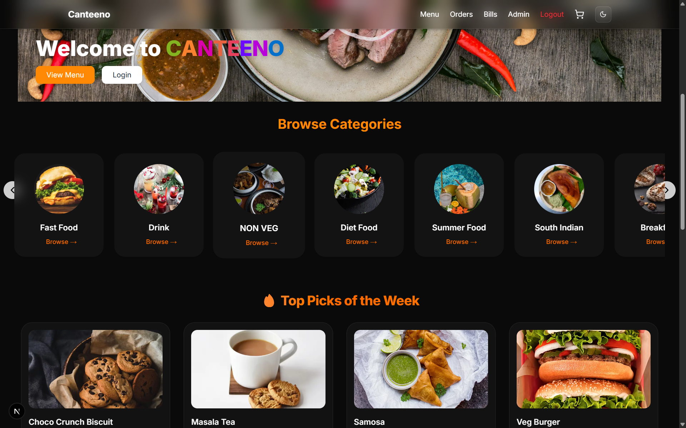
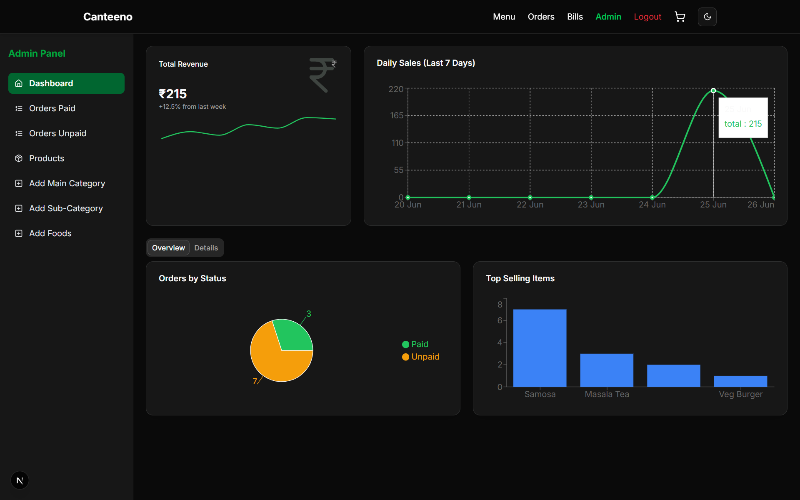

# 🍽️ Canteeno – Smart Canteen Ordering Platform

Canteeno is a full-stack food ordering and management platform built for college canteens and cloud kitchens. It allows users to browse, order, and pay for meals easily, while providing admins with powerful tools to manage menus, monitor revenue, and track payments.

---

## 🗈️ Preview

### 🔸 Home Page



### 🔸 Admin Dashboard



---

## 🚀 Tech Stack

* **Frontend**: Next.js (App Router), Tailwind CSS, Framer Motion
* **Backend**: Node.js, Express.js
* **Database**: MongoDB Atlas
* **Auth**: NextAuth (GitHub + Credentials)
* **Payments**: Razorpay, Cash on Delivery
* **Image Uploads**: Cloudinary
* **Deployment**: Vercel

---

## ✨ Features

* 👤 Role-based authentication (User & Admin)
* 🍛 Browse by category, subcategory, or top weekly picks
* 🛒 Add to cart and manage item quantity
* 💸 Pay now with Razorpay or choose **Pay Later**
* 📜 Track all orders with **paid/unpaid** status
* 📊 Admin Dashboard with:

  * Total weekly revenue tracking
  * Daily sales chart (7-day trend)
  * Pie chart of paid vs unpaid orders
  * Top 4 selling food items
* 📦 Admin Panel to:

  * Add main & subcategories
  * Add new food items
  * View all orders (paid/unpaid)

---

## 🌐 Live Demo

🔗 [canteeno-three.vercel.app](https://canteeno-three.vercel.app)

---

## 🛠️ Getting Started

### 1. Clone the Repository

```bash
git clone https://github.com/your-username/canteeno.git
cd canteeno
```

### 2. Install Dependencies

Use the following command to install all necessary packages:

```bash
npm install
```

---

### 3. Configure Environment Variables

Create a `.env.local` file in the root directory of the project and add the following:

```env
NEXTAUTH_URL=http://localhost:3000
NEXTAUTH_SECRET=your_secret
MONGODB_URI=your_mongodb_connection_string
GITHUB_CLIENT_ID=your_github_client_id
GITHUB_CLIENT_SECRET=your_github_client_secret
NEXT_PUBLIC_RAZORPAY_KEY_ID=your_razorpay_key_id
CLOUDINARY_CLOUD_NAME=your_cloudinary_name
CLOUDINARY_API_KEY=your_cloudinary_api_key
CLOUDINARY_API_SECRET=your_cloudinary_secret
```

> 🔐 **Note**: Never commit this file to GitHub. It contains sensitive data and should be listed in `.gitignore`.

---

### 4. Run the Application Locally

Once everything is set up, run the development server:

```bash
npm run dev
```

Then open [http://localhost:3000](http://localhost:3000) in your browser to view the app.

---

### ✅ You're All Set!

You're now ready to explore, develop, and test Canteeno locally. For any contribution, feature request, or issue — feel free to fork and submit a pull request!

---
